Dvojrozmerné polia
==================

Jednorozmerné polia (pythonovský typ ``list``) slúžia hlavne na uchovávanie nejakej postupnosti alebo skupiny údajov. V takejto štruktúre sa dajú uchovávať aj dvojrozmerné tabuľky, ale bolo by to zbytočne prekomplikované. Dvojrozmerné údaje sa pre nás vyskytujú, napr. v rôznych hracích plochách (štvorčekový papier pre piškvorky, šachovnica pre doskové hry, rôzne typy labyrintov), ale napr. aj rastrové obrázky sú často uchovávané v dvojrozmernej tabuľke. Aj v matematike sa niekedy pracuje s dvojrozmernými tabuľkami čísel (tzv. matice).

Už vieme, že prvkami poľa (``list``) môžu byť opäť polia. Práve táto vlastnosť nám poslúži pri reprezentácii dvojrozmerných tabuliek. Napr. takúto tabuľku (matematickú maticu 3x3):

 ::

  1 2 3
  4 5 6
  7 8 9

môžeme v Pythone zapísať:

 ::

  >>> m = [[1, 2, 3], [4, 5, 6], [7, 8, 9]]

Pole ``m`` má tri prvky: sú to tri riadky (jednorozmerné polia). Našou prvou úlohou bude vypísať takéto pole do riadkov. Ale takýto jednoduchý výpis sa nám nie vždy bude hodiť:

 ::

  >>> for riadok in m:
          print(riadok)
  [1, 2, 3]
  [4, 5, 6]
  [7, 8, 9]

Častejšie to budeme robiť dvoma vnorenými cyklami. Zadefinujme funkciu ``vypis()`` s jedným parametrom dvojrozmerným poľom:

 ::

  def vypis(pole):
      for riadok in pole:
          for prvok in riadok:
              print(prvok, end=' ')
          print()

To isté vieme zapísať aj pomocou indexovania:

 ::

  def vypis(pole):
      for i in range(len(pole)):
          for j in range(len(pole[i])):
              print(pole[i][j], end=' ')
          print()

Obe tieto funkcie sú veľmi častými šablónami pri práci s dvojrozmernými poľami. Teraz výpis poľa vyzerá takto:

 ::

  >>> vypis(m)
  1 2 3
  4 5 6
  7 8 9

Vytváranie dvojrozmerného poľa
------------------------------

Pozrime, ako môžeme vytvárať nové dvojrozmerné pole. Okrem priameho priradenia, napr.

 ::

  >>> matica = [[1, 2, 3], [4, 5, 6], [7, 8, 9]]

môžeme dvojrozmerné pole poskladať z jednotlivých riadkov, napr.

 ::
 
  >>> riadok1 = [1, 2, 3]
  >>> riadok2 = [4, 5, 6]
  >>> riadok3 = [7, 8, 9]
  >>> matica = [riadok1, riadok2, riadok3]

Najčastejšie to ale bude pomocou nejakých cyklov. Bude to závisieť od toho, či sa vo výslednom poli niečo opakuje. Vytvorme dvojrozmerné pole veľkosti 3x3, ktoré obsahuje samé ``0``:

 ::

  >>> matica = []
  >>> for i in range(3):
          matica.append([0, 0, 0])
  >>> matica
  [[0, 0, 0], [0, 0, 0], [0, 0, 0]]
  >>> vypis(matica)
  0 0 0
  0 0 0
  0 0 0

Využili sme tu štandardný spôsob vytvárania jednorozmerného poľa pomocou metódy ``append()``. Obsah ľubovoľného prvku matice môžeme zmeniť obyčajným priradením:

 ::

  >>> matica[0][1] = 9
  >>> matica[1][2] += 1
  >>> vypis(matica)
  0 9 0
  0 0 1
  0 0 0

Prvý index v ``[]`` zátvorkách väčšinou bude pre nás označovať poradové číslo riadka, v druhých zátvorkách je poradové číslo stĺpca. Už sme si zvykli, že riadky aj stĺpce sú číslované od 0.

Hoci pri definovaní matice sa zdá, že sa 3-krát opakuje to isté. Zapíšme to pomocou viacnásobného zreťazenia (operácia ``*``) polí:

 ::

  >>> matica1 = [[0, 0, 0]] * 3

Žiaľ, toto je veľmi nesprávny spôsob vytvárania dvojrozmerného poľa: zápis ``[0, 0, 0]`` označuje **referenciu** na jednorozmerné trojprvkové pole, potom ``[[0, 0, 0]]*3`` rozkopíruje túto jednu referenciu trikrát. Teda vytvorili sme pole, ktoré trikrát obsahuje referenciu na ten istý riadok. Presvedčíme sa o tom priradením do niektorých prvkov takéhoto poľa:

 ::

  >>> matica1[0][1] = 9
  >>> matica1[1][2] += 1
  >>> vypis(matica1)
  0 9 1
  0 9 1
  0 9 1
  
Uvedomte si, že zápis:

 ::

  >>> matica1 = [[0, 0, 0]] * 3

v skutočnosti znamená:

 ::

  >>> riadok = [0, 0, 0]
  >>> matica1 = [riadok, riadok, riadok]

Zapamätajte si! Dvojrozmerné pole nikdy nevytvárame tak, že viacnásobne zreťazujeme (násobíme) jeden riadok viackrát. Pritom

 ::

  >>> matica2 = [[0]*3, [0]*3, [0]*3]

je už v poriadku, lebo sme v tomto poli vytvorili tri rôzne riadky.

Niekedy sa na vytvorenie "prázdneho" dvojrozmerného poľa definuje funkcia:

 ::

  def vyrob(pocet_riadkov, pocet_stlpcov, hodnota=0):
      vysl = []
      for i in range(pocet_riadkov):
          vysl.append([hodnota] * pocet_stlpcov)
      return vysl

Otestujme:

 ::

  >>> a = vyrob(3, 5)
  >>> vypis(a)
  0 0 0 0 0
  0 0 0 0 0
  0 0 0 0 0
  >>> b = vyrob(2, 6, '*')
  >>> vypis(b)
  * * * * * *
  * * * * * *

Niekedy potrebujeme do takto pripraveného poľa priradiť nejaké hodnoty, napr. postupným zvyšovaním nejakého počítadla:

 ::

  def ocisluj(pole):
      poc = 0
      for i in range(len(pole)):
          for j in range(len(pole[i])):
              pole[i][j] = poc
              poc += 1

Všimnite si, že táto funkcia vychádza z druhej funkcie (šablóny) pre vypisovanie dvojrozmerného poľa: namiesto výpisu prvku (``print()``) sme do neho niečo priradili. Táto funkcia ``ocisluj()`` nič nevypisuje ani nevracia žiadnu hodnotu "len" modifikuje obsah poľa, ktorý je parametrom tejto funkcie.

 ::

  >>> a = vyrob(3, 5)
  >>> ocisluj(a)
  >>> vypis(a)
  0 1 2 3 4
  5 6 7 8 9
  10 11 12 13 14

.. rubric:: Niekoľko príkladov práce s dvojrozmerným poľom

1. zvýšime obsah všetkých prvkov o 1

 ::

  def zvys_o_1(pole):
      for riadok in pole:
          for i in range(len(riadok)):
              riadok[i] += 1

 Zrejme musia byť všetky prvky tohto poľa nejaké čísla, inak by funkcia spadla na chybe.

 ::

  >>> p = [[5, 6, 7], [0, 0, 0], [-3, -2, -1]]
  >>> zvys_o_1(p)
  >>> p
  [[6, 7, 8], [1, 1, 1], [-2, -1, 0]]

2. podobný cieľ má aj druhá funkcia: hoci nemení samotné pole, ale vytvárajú nové pole, ktorého prvky sú o jedna väčšie:

 ::

  def o_1_viac(pole):
      nove_pole = []
      for riadok in pole:
          novy_riadok = [0] * len(riadok)
          for i in range(len(riadok)):
              novy_riadok[i] = riadok[i]+1
          nove_pole.append(novy_riadok)
      return nove_pole

3. číslovanie prvkov poľa inak ako to robila funkcia ``cisluj()``: nie po riadkoch ale po stĺpcoch. Predpokladáme, že všetky riadky sú rovnako dlhé:

 ::

  def ocisluj_po_stlpcoch(pole):
      poc = 0
      for j in range(len(pole[0])):
          for i in range(len(pole)):
              pole[i][j] = poc
              poc += 1

 Všimnite si, že táto funkcia má oproti ``ocisluj()`` len vymenené dva riadky for-cyklov.

  >>> a = vyrob(3, 5)
  >>> ocisluj_po_stlpcoch(a)
  >>> vypis(a)
  0 3 6 9 12
  1 4 7 10 13
  2 5 8 11 14

4. spočítame počet výskytov nejakej hodnoty:

 ::

  def pocet(pole, hodnota):
      vysl = 0
      for riadok in pole:
          for prvok in riadok:
              if prvok == hodnota:
                  vysl += 1
      return vysl

 Využili sme tu prvú verziu funkcie (šablóny) pre výpis dvojrozmerného poľa. Ak si ale pripomenieme, že niečo podobné robí štandardná metóda ``count()``, ale táto funguje len pre jednorozmerné polia, môžeme našu funkciu vylepšiť:

 ::

  def pocet(pole, hodnota):
      vysl = 0
      for riadok in pole:
          vysl += riadok.count(hodnota)
      return vysl

 Otestujeme:

 ::

  >>> a = [[1, 2, 1, 2], [4, 3, 2, 1], [2, 1, 3, 1]]
  >>> pocet(a, 1)
  5
  >>> pocet(a, 4)
  1
  >>> pocet(a, 5)
  0

5. funkcia zistí, či je nejaká matica (dvojrozmerné pole) symetrická, t. j. či sú prvky pod a nad hlavnou uhlopriečkou rovnaké, čo znamená, že má platiť ``pole[i][j] == pole[j][i]`` pre každé ``i`` a ``j``:

 ::

  def index(pole, hodnota):
      vysl = True
      for i in range(len(pole)):
          for j in range(len(pole[i])):
              if pole[i][j] != pole[j][i]:
                  vysl = False
      return vysl

 Hoci je toto riešenie správne, má niekoľko nedostatkov:

 * funkcia zbytočne testuje každú dvojicu prvkov ``pole[i][j]`` a ``pole[j][i]`` dvakrát, napr. ``pole[0][2] == pole[2][0]`` aj ``pole[2][0] == pole[0][2]``, tiež zrejme netreba kontrolovať prvky na hlavnej uhlopriečke, či ``pole[i][i] == pole[i][i]``
 * keď sa vo vnútornom cykle zistí, že sme našli dvojicu ``pole[i][j]`` a ``pole[j][i]``, ktoré sú navzájom rôzne, zapamätá sa, že výsledok funkcie bude ``False`` a ďalej sa pokračuje prehľadávať dvojrozmerné pole - toto je zrejme zbytočné, lebo výsledok je už známy - asi by sme mali vyskočiť z týchto cyklov; POZOR! príkaz ``break`` ale neurobí to, čo by sa nám tu hodilo:

 ::

  def index(pole, hodnota):
      vysl = True
      for i in range(len(pole)):
          for j in range(len(pole[i])):
              if pole[i][j] != pole[j][i]:
                  vysl = False
                  break                     # vyskočí z cyklu
      return vysl

 Takéto vyskočenie z cyklu nám veľmi nepomôže, lebo vyskakuje sa len z vnútorného a ďalej sa pokračuje vo vonkajšom. Našťastie my tu nepotrebujeme vyskakovať z cyklu, ale môžeme priamo ukončiť celú funkciu aj s návratovou hodnotou ``False``.

 Prepíšme funkciu tak, aby zbytočne dvakrát nekontrolovala každú dvojicu prvkov a aby sa korektne ukončila, keď nájde nerovnakú dvojicu:

 ::

  def index(pole, hodnota):
      for i in range(1, len(pole)):
          for j in range(i):
              if pole[i][j] != pole[j][i]:
                  return False
      return True

6. funkcia vráti pozíciu prvého výskytu nejakej hodnoty, teda dvojicu ``(riadok, stĺpec)``. Keďže budeme potrebovať poznať indexy konkrétnych prvkov poľa, použijeme šablónu s indexmi:

 ::

  def index(pole, hodnota):
      for i in range(len(pole)):
          for j in range(len(pole[i])):
              if pole[i][j] == hodnota:
                  return i, j

 Funkcia skončí, keď nájde prvý výskyt hľadanej hodnoty (prechádza po riadkoch zľava doprava):

 ::

   >>> a = [[1, 2, 1, 2], [1, 2, 3, 4], [2, 1, 3, 1]]
   >>> index(a, 3)
   (1, 2)
   >>> index(a, 5)
   >>>

Na tomto poslednom príklade vidíme, že naša funkcia ``index()`` v nejakom prípade nevrátila "nič". V skutočnosti vrátila špeciálnu hodnotu ``None``, ktorá sa v príkazovom režime nevypisuje. Ak by sme výsledok volania funkcie vypísali príkazom ``print()``, dozvieme sa:

 ::

   >>> print(index(a, 5))
   None
   >>>

.. topic:: hodnota ``None``

   Táto špeciálna hodnota je výsledkom všetkých funkcií, ktoré nevracajú žiadnu hodnotu pomocou ``return``. To znamená, že každá funkcia ukončená bez ``return`` v skutočnosti vracia ``None`` ako keby posledným príkazom funkcie bol

    ::

     return None

   Túto hodnotu môžeme často využívať v situáciách, keď chceme nejako oznámiť, že napr. výsledok hľadania bol neúspešný. Tak ako to bolo v prípade našej funkcie ``index()``, ktorá v prípade, že sa hľadaná hodnota v poli nenašla vrátila ``None``. Je zvykom takýto výsledok testovať takto:

   ::

    vysledok = index(pole, hodnota)
    if vysledok is None:
        print('nenasiel')
    else:
        riadok, stlpec = vysledok

  Teda namiesto testu ``premenna == None`` alebo ``premenna != None`` radšej používame ``premenna is None`` alebo ``premenna is not None``.

.. rubric:: Polia s rôzne dlhými riadkami

Doteraz sme predpokladali, že všetky riadky dvojrozmerného poľa majú rovnakú dĺžku. Niekedy sa ale stretáme so situáciou, keď dvojrozmerné pole môže mať riadky rôznych dĺžok. Napr.

 ::

  >>> pt = [[1], [1, 1], [1, 2, 1], [1, 3, 3, 1], [1, 4, 6, 4, 1], [1, 5, 10, 10, 5, 1]]
  >>> vypis(pt)
  1
  1 1
  1 2 1
  1 3 3 1
  1 4 6 4 1
  1 5 10 10 5 1

Toto pole obsahuje prvých niekoľko riadkov Pascalovho trojuholníka. Našťastie funkciu ``vypis()`` (obe verzie) sme napísali tak, že správne vypíšu aj polia s rôzne dlhými riadkami.

Niektoré polia nemusia mať takto pravidelný tvar, napr.

 ::

  >>> delitele = [[6, 2, 3], [13, 13], [280, 2, 2, 2, 5, 7], [1]]
  >>> vypis(delitele)
  6 2 3
  13 13
  280 2 2 2 5 7
  1

Pole ``delitele`` má v každom riadku rozklad nejakého čísla (prvý prvok) na prvočinitele (súčin zvyšných prvkov)

Preto už pri zostavovaní funkcií musíme myslieť na to, že parametrom môže byť aj pole s rôznou dĺžkou riadkov. Zapíšme funkciu, ktorá nám vráti zoznam všetkých dĺžok riadkov daného dvojrozmerného poľa:

 ::

  def dlzky(pole):
      vysl = []
      for riadok in pole:
          vysl.append(len(riadok))
      return vysl

Pre naše dva príklady polí dostávame:

 ::

  >>> dlzky(pt)
  [1, 2, 3, 4, 5, 6]
  >>> dlzky(delitele)
  [3, 2, 6, 1]

Podobným spôsobom môžeme generovať nové dvojrozmerné pole s rôznou dĺžkou riadkov, pre ktoré poznáme len tieto dĺžky:

 ::

  def vyrob(dlzky, hodnota=0):
      vysl = []
      for dlzka in dlzky:
          vysl.append([hodnota]*dlzka)
      return vysl

Otestujeme:

 ::

  >>> m1 = vyrob([3, 0, 1])
  >>> m1
  [[0, 0, 0], [], [0]]
  >>> m2 = vyrob(dlzky(delitele), 1)
  >>> vypis(m2)
  1 1 1
  1 1
  1 1 1 1 1 1
  1

Zamyslite sa, ako budú vyzerať tieto polia:

 ::

  >>> n = 7
  >>> m3 = vyrob([n]*n)
  >>> m4 = vyrob(range(n))
  >>> m5 = vyrob(range(n, 0, -2))

.. rubric:: Pole farieb

Ukážme dve malé aplikácie, v ktorých vytvoríme dvojrozmerné pole náhodných farieb, potom toto pole vykreslíme do grafickej plochy ako pole malých farebných štvorčekov - vznikne farebná mozaika a na záver to otestujeme klikaním myšou.

Prvý program vygeneruje dvojrozmerné pole náhodných farieb, vykreslí ho a uloží do textového súboru:

 ::

  import tkinter
  import random

  canvas = tkinter.Canvas()
  canvas.pack()

  pole = []
  for i in range(20):
      p = []
      for j in range(30):
          p.append('#{:06x}'.format(random.randrange(256**3)))
      pole.append(p)

  d, x0, y0 = 10, 30, 10
  for i in range(len(pole)):
      for j in range(len(pole[i])):
          x, y = d*j+x0, d*i+y0
          canvas.create_rectangle(x, y, x+d, y+d, fill=pole[i][j], outline='')

  with open('obr.txt', 'w') as subor:
      for riadok in pole:
          print(' '.join(riadok), file=subor)

Vznikne približne takýto obrázok

 .. image:: image/13_1.png
    :width: 300 px

V druhej časti programu už nebudeme generovať dvojrozmerné pole, ale prečítame ho z uloženého súboru. Keďže plánujeme klikaním meniť farby kliknutých štvorčekov, musíme si pamätať ich identifikačné čísla, ktoré vznikajú pri ich vykreslení pomocou ``create_rectangle()`` - použijeme na to pomocné dvojrozmerné pole ``re`` (rovnakých rozmerov ako pole farieb). Na záver doplníme funkciu na zabezpečenie klikania: kliknutý štvorček sa zafarbí, napr. na bielo:

 ::

  import tkinter

  canvas = tkinter.Canvas()
  canvas.pack()

  pole = []
  with open('obr.txt') as subor:
      for riadok in subor:
          pole.append(riadok.split())

  # inicializuj pomocné pole re[][] pre id nakreslených štvorčekov
  re = []
  for i in range(len(pole)):
      re.append([0] * len(pole[i]))
  # vykresli a id. cisla uloz do pola re[][]
  d, x0, y0 = 10, 30, 10
  for i in range(len(pole)):
      for j in range(len(pole[i])):
          x, y = d*j+x0, d*i+y0
          re[i][j] = canvas.create_rectangle(x, y, x+d, y+d, fill=pole[i][j], outline='')

  def klik(event):
      stlpec, riadok = (event.x-x0)//d, (event.y-y0)//d
      if 0<=riadok<len(pole) and 0<=stlpec<len(pole[riadok]):
          canvas.itemconfig(re[riadok][stlpec], fill='white')
          #pole[riadok][stlpec] = 'white'

  canvas.bind('<Button-1>', klik)

Všimnite si, ako sme počítali pozíciu kliknutého štvorčeka.

Hra LIFE
--------

Informácie k tejto informatickej simulačnej hre nájdete na `wikipedii <http://en.wikipedia.org/wiki/Conway%27s_Game_of_Life>`_

Pravidlá:

* v nekonečnej štvorcovej sieti žijú bunky, ktoré sa rôzne rozmnožujú, resp. umierajú
* v každom políčku siete je buď živá bunka, alebo je políčko prázdne (budeme označovať ako **1** a **0**)
* každé políčko má 8 susedov (vodorovne, zvislo aj po uhlopriečke)
* v každej generácii sa s každým jedným políčkom:

  * ak je na políčku bunka a má práve 2 alebo 3 susedov, tak táto bunka prežije aj do ďalšej generácie
  * ak je na políčku bunka a má buď 0 alebo 1 suseda, alebo viac ako 3 susedov, tak bunka na tomto políčku do ďalšej generácie neprežije (umiera)
  * ak má prázdne políčko presne na troch susediacich políčkach živé bunky, tak sa tu v ďalšej generácii narodí nová bunka

Štvorcovú sieť s ``0`` a ``1`` budeme ukladať v dvojrozmernom poli veľkosti ``n`` x ``n``. V tomto poli je momentálna generácia bunkových živočíchov. Na to, aby sme vyrobili novú generáciu, si pripravíme pomocné pole rovnakej veľkosti a do tohto budeme postupne zapisovať bunky novej generácie. Keď už bude celé toto pomocné pole hotové, prekopírujeme ho do pôvodného poľa. Dvojrozmerné pole budeme vykresľovať do grafickej plochy.

 ::

  import tkinter
  import random

  def inicializuj_siet():
      d, x0, y0 = 8, 30, 10
      re = []
      for i in range(n):
          re.append([0]*n)
          for j in range(n):
              x, y = d*j+x0, d*i+y0
              re[i][j] = canvas.create_rectangle(x, y, x+d, y+d, fill='white', outline='gray')
      return re

  def nahodne():
      pole = []
      for i in range(n):
          p = []
          for j in range(n):
              p.append(random.randrange(2))
          pole.append(p)
      return pole

  def kresli():
      for i in range(n):
          for j in range(n):
              farba = ['white','black'][pole[i][j]]
              canvas.itemconfig(re[i][j], fill=farba)

  def pocet_susedov(rr, ss):
      pocet = -pole[rr][ss]
      for r in rr-1, rr, rr+1:
          for s in ss-1, ss, ss+1:
              if 0<=r<n and 0<=s<n:
                  pocet += pole[r][s]
      return pocet

  def nova():
      pole1 = []
      for i in range(n):
          pole1.append([0] * n)

      for i in range(n):
          for j in range(n):
              p = pocet_susedov(i, j)
              if p == 3 or p == 2 and pole[i][j]:
                  pole1[i][j] = 1

      for i in range(n):
          pole[i] = pole1[i]

      kresli()

  def rob(kolko=100, ms=100):
      for i in range(kolko):
          nova()
          canvas.update()
          canvas.after(ms)

  # štart

  canvas = tkinter.Canvas(width=600, height=500)
  canvas.pack()

  n = 50
  re = inicializuj_siet()
  pole = nahodne()
  kresli()
  rob()

Na tejto sérii obrázkov môžete sledovať, ako sa s nejakej náhodnej pozície postupne generujú ďalšie generácie:

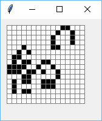

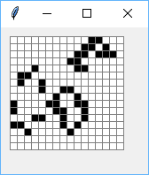

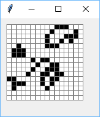

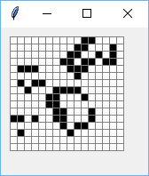

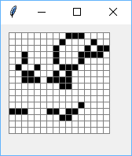

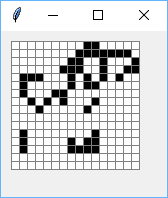

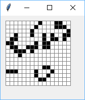

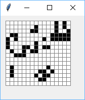

Namiesto náhodného poľa môžeme vytvoriť prázdne (vynulované) pole, do ktorého priradíme:

 ::
 
  pole[5][2] = pole[5][3] = pole[5][4] = pole[4][4] = pole[3][3] = 1

Dostávame takýto klzák (glider), ktorý sa pohybuje po ploche nejakým smerom:

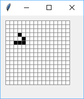

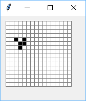

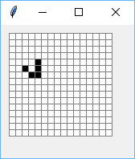

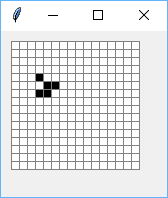

Všimnite si, že po 4 generáciách má rovnaký tvar, ale je posunutý o 1 políčko dole a vpravo.

Cvičenie
--------

1. Funkcia ``vypis_sucty(pole)`` vypíše súčty prvkov v jednotlivých riadkoch poľa, súčty vypisuje vedľa seba.

   * napr.

    ::

     >>> vypis_sucty([[1, 2, 3], [4], [5, 6]])
     6 4 11

2. Funkcia ``pole_suctov(pole)`` počíta súčty prvkov v riadkoch (podobne ako v predchádzajúcej úlohe), ale tieto súčty nevypisuje ale ukladá do výsledného poľa.

   * napr.

    ::

     >>> suc = pole_suctov([[1, 2, 3], [4], [5, 6]])
     >>> suc
     [6, 4, 11]

3. Funkcia ``pridaj_sucty(pole)`` podobne ako predchádzajúce úlohy počíta súčty po riadkoch, ale ich ukladá na koniec každého riadka poľa.

   * napr.

    ::

     >>> a = [[1, 2, 3], [4], [5, 6]]
     >>> pridaj_sucty(a)
     >>> a
     [[1, 2, 3, 6], [4, 4], [5, 6, 11]]

4. Funkcia ``kopia(pole)`` vráti kópiu vstupného poľa.

   * napr.

    ::

     >>> a = [[1, 2, 3], [4], [5, 6]]
     >>> b = kopia(a)
     >>> a[2][1] = 99
     >>> a
     [[1, 2, 3], [4], [5, 99]]
     >>> b
     [[1, 2, 3], [4], [5, 6]]

5. Funkcia ``preklop(pole)`` vyrobí nové, v ktorom bude pôvodné pole preklopené okolo hlavnej uhlopriečky. Predpokladáme, že všetky riadky majú rovnakú dĺžku.

   * napr.

    ::

     >>> p = [[1, 2], [5, 6], [3, 4]]
     >>> q = preklop(p)
     >>> q
     [[1, 5, 3], [2, 6, 4]]

6. Funkcia ``preklop_pole(pole)`` pracuje ako predchádzajúci príklad, ale namiesto výsledného poľa (teda funkcia nič nevracia) funkcia zmení samotné vstupné pole.

   * napr.

    ::

     >>> p = [[1, 2], [5, 6], [3, 4]]
     >>> preklop_pole(p)
     >>> p
     [[1, 5, 3], [2, 6, 4]]

7. Funkcia ``zisti_dlzky(pole)`` zistí, či sú všetky riadky vstupného poľa rovnako dlhé, ak áno, funkcia vráti túto dĺžku, inak vráti ``None``.

   * napr.

    ::

     >>> p = [[1, 2], [3, 4], [5, 6]]
     >>> zisti_dlzky(p)
     2
     >>> zisti_dlzky([[1, 2, 3]])
     3
     >>> zisti_dlzky([[], [1, 2, 3]])    # vráti None
     >>>

8. Funkcia ``dopln(pole)`` doplní do vstupného poľa do každého riadka minimálny počet ``None`` tak, aby mali všetky riadky rovnakú dĺžku.

   * napr.

    ::

     >>> a = [[5, 6], [1, 2, 3], [4]]
     >>> dopln(a)
     >>> a
     [[5, 6, None], [1, 2, 3], [4, None, None]]

9. Zistite, čo počíta táto funkcia:

   *

    ::

     def test(pole):
         vysl, n = 0, len(pole)
         for i in range(n):
             for j in range(n):
                 vysl += abs(pole[i][j]-pole[j][i])
         return vysl == 0

   * čo vráti

    ::

     >>> test([[1, 2], [1, 1]])

10. Funkcia ``zisti(pole1, pole2)`` zistí, či majú dve vstupné polia úplne rovnaké rozmery, t. j. majú rovnaký počet rovnakodlhých riadkov.

   * napr.

    ::

     >>> a = [[5, 6], [1, 2, 3], [4]]
     >>> b = [[0, 0], [0, 0, 0], [0]]
     >>> zisti(a, b)
     True
     >>> del b[-1][-1]
     >>> zisti(a, b)
     False

11. Funkcia ``sucet(pole1, pole2)`` vráti nové pole, ktoré je súčtom dvoch vstupných rovnakoveľkých číselných polí. Funkcia vráti nové pole, v ktorom je každý prvok súčtom dvoch prvkov zo vstupných polí s rovnakým indexom.

   * napr.

    ::

     >>> a = [[5, 6], [1, 2, 3], [4]]
     >>> b = [[-1, -3], [-2, 0, 1], [2]]
     >>> c = sucet(a, b)
     >>> c
     [[4, 3], [-1, 2, 4], [6]]

12. Textový súbor v každom riadku obsahuje niekoľko slov, oddelených medzerou (riadok môže byť aj prázdny). Funkcia ``citaj(meno_suboru)`` prečíta tento súbor a vyrobí z neho dvojrozmerné pole: každý riadok poľa zodpovedá jednému riadku súboru,

   * napr. ak súbor ``text.txt``:

    ::

     anicka dusicka
     kde si bola
     ked si si cizmicky
     zarosila

   * potom

    ::

     >>> s = citaj('text.txt')
     >>> s
     [['anicka', 'dusicka'], ['kde', 'si', 'bola'], ['ked', 'si', 'si', 'cizmicky'], ['zarosila']]

13. Funkcia ``zapis(pole, meno_suboru)`` je opačná k predchádzajúcemu príkladu: zapíše dané dvojrozmerné pole slov do súboru.

   * napr.

    ::

     >>> s = [['anicka', 'dusicka'], ['kde', 'si', 'bola'], ['ked', 'si', 'si', 'cizmicky'], ['zarosila']]
     >>> zapis(s, 'text1.txt')

    vytvorí rovnaký súbor ako bol ``text.txt``

14. Funkcia ``prvky(pole)`` z dvojrozmerného poľa vyrobí (funkcia vráti) jednorozmerné: všetky prvky postupne pridáva do výsledného poľa.

   * napr.

    ::

     >>> a = [[5, 6], [1, 2, 3], [4]]
     >>> b = prvku(a)
     >>> b
     [5, 6, 1, 2, 3, 4]

15. Funkcia ``vyrob(pr, ps, pole)`` vyrobí dvojrozmerné pole s počtom riadkov ``pr`` a počtom stĺpcov ``ps``. Prvky jednorozmerného poľa postupne priradzuje po riadkoch do novovytvoreného. Ak je vstupné pole hodnôt kratšie ako potrebujeme, začne z neho čítať od začiatku.

   * napr.

    ::

     >>> xy = vyrob(3, 2, [3, 5, 7])
     >>> xy
     [[3, 5], [7, 3], [5, 7]]

16. Funkcia ``po_jednom(pole, meno_suboru)`` zapíše prvky dvojrozmerného poľa čísel do súboru tak, že do každého riadka súboru zapíše po jednom čísle. Okrem toho na konci každého riadka poľa do súboru zapíše prázdny riadok.

   * napr.

    ::

     >>> d = [[314, 2016], [], [-4]]
     >>> po_jednom(d, 'cisla.txt')

   * vyrobí súbor

    ::

     314
     2016

     -4

17. Funkcia ``citaj1(meno_suboru)`` je opačná k predchádzajúcemu príkladu: funkcia prečíta súbor a vytvorí dvojrozmerné pole, pričom prázdne riadky v súbore označujú nový riadok v poli.

   * napr. pre súbor z predchádzajúceho príkladu

    ::

     >>> e = citaj1('cisla.txt')
     >>> e
     [[314, 2016], [], [-4]]

18. Vytvorte (napr. v notepade) textový súbor, ktorý obsahuje aspoň 5 riadkov s piatimi farbami (len mená farieb). Napíšte funkciu ``kruhy(meno_suboru)``, ktorá prečíta tento súbor a farby zo súboru vykreslí ako farebné kruhy. Tieto budú vykreslené tesne vedľa saba po riadkoch.

   * napr. súbor môže vyzerať takto

    ::

     yellow yellow blus yellow yellow
     yellow blue yellow blue yellow
     blue yellow red yellow blue
     yellow blue yellow blue yellow
     yellow yellow blue yellow yellow

   * volanie

    ::

     >>> kruhy('farby.txt')
     # vykreslí 25 kruhov v piatich radoch po 5

19. Predchádzajúci príklad upravte tak, aby ak by bol v súbore namiesto nejakej farby ``None``, bude to označovať, že sa príslušný kruh vynechá (ostane po ňom prázdne miesto).

   * napr. súbor môže vyzerať aj takto

    ::

     yellow yellow blus yellow yellow
     yellow blue None blue yellow
     blue None red None blue
     yellow blue None blue yellow
     yellow yellow blue yellow yellow

   * volanie

    ::

     >>> kruhy('farby.txt')
     # vykreslí 21 kruhov v piatich radoch po 5, 4, 3, 4, 5 kruhoch

..
  x. každý riadok skráti na zadanú dĺžku (kratšie nechá tak)

